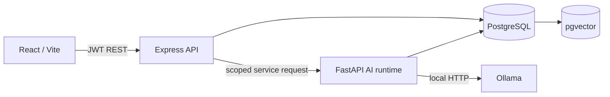

# Architecture

Express verifies credentials, applies role checks, records API audit events, and exposes stable client contracts. FastAPI parses files, chunks text, calls the configured Ollama embedding model, retrieves organisation-scoped vectors, and calls the configured local generation model. Structured analysis uses explicit parameterized query templates. Evidence and metrics are returned separately from the natural-language answer.

The runtime requires a shared internal service token and trusts only the authenticated gateway's scoped user/role headers. It has no published host port. Document ACLs are enforced in metadata reads, search, RAG and saved-result inspection. New documents retain source bytes and durable processing/failed/ready status in PostgreSQL; manual retries serialize by content hash and atomically index chunks. Local inference selects evidence IDs; answers combine fixed SQL/Decimal facts with exact source excerpts to prevent generated figures or causes. Browser history reads re-evaluate source access on every request. Compose host ports bind only to localhost; the project's published PostgreSQL port defaults to 5433.
