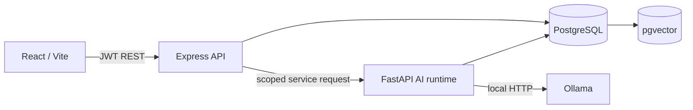

# Architecture

Express verifies credentials, applies role checks, records API audit events, and exposes stable client contracts. FastAPI parses files, chunks text, calls the configured Ollama embedding model, retrieves organisation-scoped vectors, and calls the configured local generation model. Structured analysis uses explicit parameterized query templates. Evidence and metrics are returned separately from the natural-language answer.

The Compose runtime currently relies on private-network placement and gateway headers for runtime identity. The AI runtime must not be exposed outside that network until service authentication is added. Document ACLs beyond organisation scope are future work.
